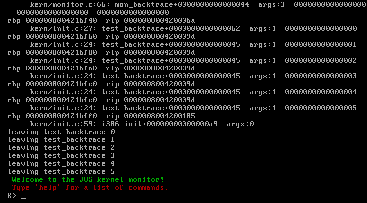

# Advanced OS labs-fall 2021

## Useful Links
- [x86 Architecture](https://en.wikibooks.org/wiki/X86_Assembly/X86_Architecture)
- [x86 Instruction](https://en.wikibooks.org/wiki/X86_Assembly/X86_Instructions)
- [GDB cheat-sheat](https://cs.brown.edu/courses/cs033/docs/guides/gdb.pdf)
- [Inilne Assembly](https://www.ibiblio.org/gferg/ldp/GCC-Inline-Assembly-HOWTO.html)

## Useful Books
- RHEL 3, Using as, the Gnu Assembler

## Useful Notes

### Keyboard Controller
Refrences: https://stanislavs.org/helppc/8042.html

    `0x64` is the IO port of the `keyboard controller` which has two ports `0x64(Command port)` and `0x60(Data port)`,
    Status Register - PS/2 Controller

	8042 Status Register (port 64h read)

	|7|6|5|4|3|2|1|0|  8042 Status Register
	 | | | | | | | `---- output register (60h) has data for system
	 | | | | | | `----- input register (60h/64h) has data for 8042
	 | | | | | `------ system flag (set to 0 after power on reset)
	 | | | | `------- data in input register is command (1) or data (0)
	 | | | `-------- 1=keyboard enabled, 0=keyboard disabled (via switch)
	 | | `--------- 1=transmit timeout (data transmit not complete)
	 | `---------- 1=receive timeout (data transmit not complete)
	 `----------- 1=even parity rec'd, 0=odd parity rec'd (should be odd)

## Chalanges

### Lab 1 Chalange

Format of writing to vga port is like:
| blank | background color |  Foreground color | Code Point |
| :-----: | :----------------: | :-----------------: | :-----------: |
| 8 | 7 6 5 4 | 3 2 1 0 | 7 6 5 4 3 2 1 0 | 

you can see in `cga_putc` in `console.h` function if no attribute color is set in the input argument it setting the foreground color to `white` (7) and bakcground color to `black` (0):

```c
static void
cga_putc(int c)
{
	if (!(c & ~0xFF))
		c |= 0x0700;
	.
	.
	.
}

```

so some how we must set the attribute bytes in `lib/printfmt.c`:

```c
void
vprintfmt(void (*putch)(int, void*), void *putdat, const char *fmt, va_list ap)
{
...
	while ((ch = *(unsigned char *) fmt++) != '%') {
		if (ch == '\0') {
			color = 0;
			return;
		}
		ch |= color << 8;
		putch(ch, putdat);
	}
...
        case 'r':
		color = getuint(&aq, 1);
		break;

...
}
```

you can see from the above code you can see attribute byte with `%r` in cprintf, for example we have changed the code in `monitor.c`:
```c
void
monitor(struct Trapframe *tf)
{
...
	cprintf("%r Welcome to the JOS kernel monitor!\n", 2);
	cprintf("%r Type 'help' for a list of commands.\n", 4);
...
}
```

The first statement is printing in green color and the second one is printing in red.


